# MyFinance.

Nesse repositório contém um projeto fullstack realizado o front-end com Html, Css, BootStrap 4, JavaScript e o back-end com Python e o framework Django.

O projeto consiste em um sistema para controle financeiro pessoal, é possível acompanhar toda a sua vida financeira em um só lugar, o sistema permite gerenciar despesas, receitas e investimentos. Também contém funcionalidades de relatório, como por exemplo, baixar uma planilha em excel com os dados das despesas, receitas e investimentos de acordo com os filtros escolhidos pelo usuário.

### Pré-requisitos

- Python instalado;
- Criação do ambiente virtual (Linux: python3 -m venv venv ou no Windows: python -m venv venv);
- Ativação do ambiente criado anteriormente (Linux: source venv/bin/activate ou no Windows: venv\Scripts\activate);
- Instalação dos requirements.txt disponibilizados (pip insall -r requirements.txt);
- O banco de dados é de sua escolha, mas nesse projeto utilizei o SQLite (Caso escolha um banco de dados diferente do padrão não esqueça de realizar as alterações no arquivo settings.py);
- OBS¹: Caso tenha o Docker intalado será o suficiente e apenas precisará rodar o docker compose disponibilizado
(No diretório do projeto rodar o comando: docker compose -f docker-compose.yml up -d --build);
- OBS²: Caso opte por rodar o projeto sem usar o docker, é necessário remover algumas configurações de variáveis de ambiente existente no settings.py e deixar padrão;

### Execução do sistema

- Basta entrar no diretório do projeto e no terminal rodar o comando: python manage.py runserver ou docker compose -f docker-compose.yml up -d --build;
- O servidor será executado e se acessar localhost:8006 acessará a página inicial do sistema onde poderá realizar o cadastro ou o login;

### Exemplo da execução

- Obs: As páginas são acessíveis somente com o usuário autenticado, obviamente, a home, login e cadastro são de livre acesso.

- Home

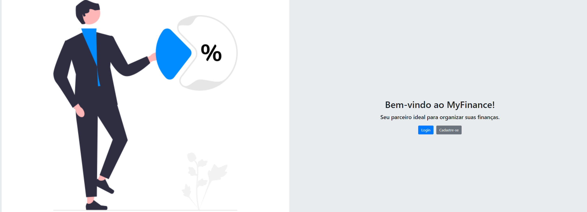

- Login

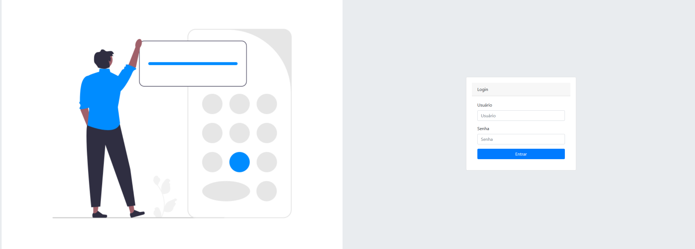

- Cadastre-se

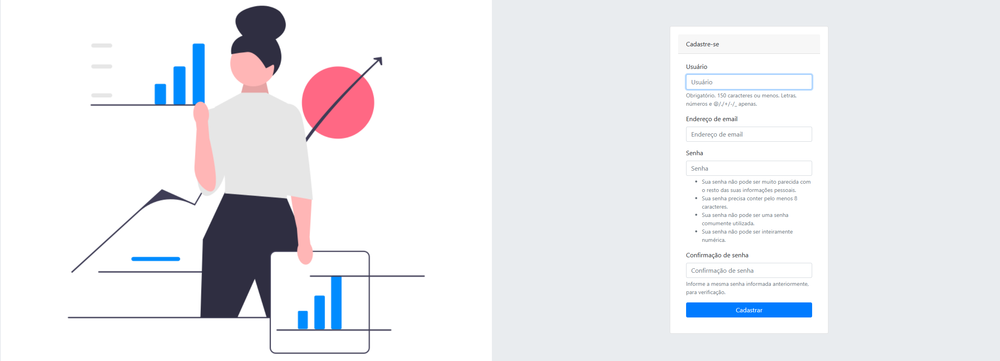

#### Dashboard

- Ao realizar o login, o usuário é redirecionado para o seu dashboard

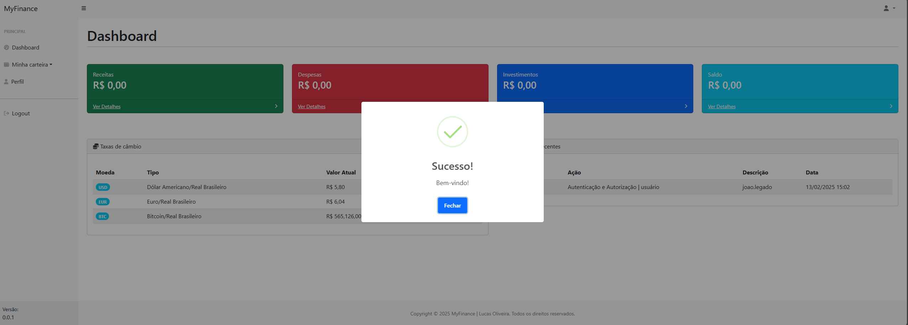

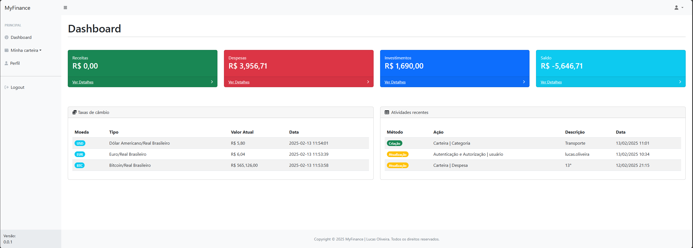

#### Perfil

##### Gerenciamento do perfil

- Visualização geral do perfil

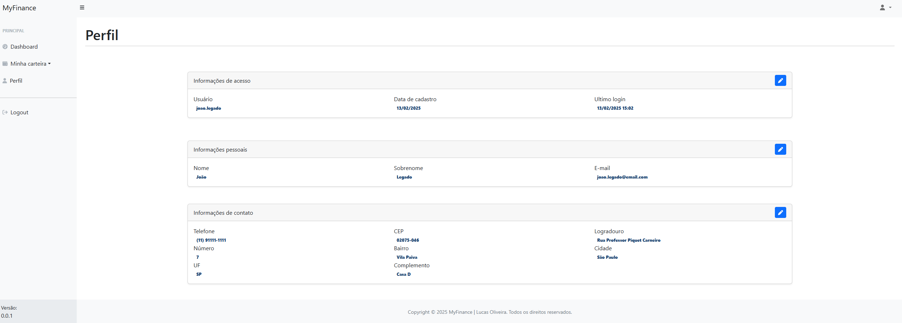

- Alterar senha

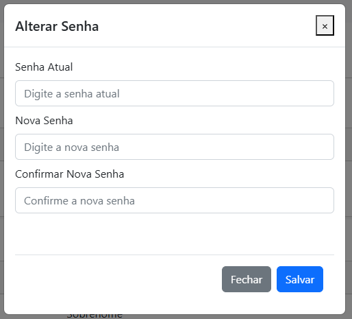

- Alterar informações pessoais

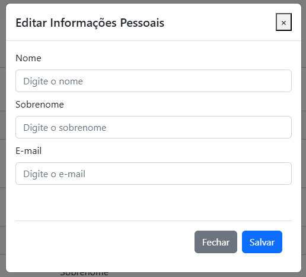

- Alterar endereço
- Obs: Ao alterar o endereço, basta digitar somente o cep que os demais campos serão preenchidos automáticamente. 

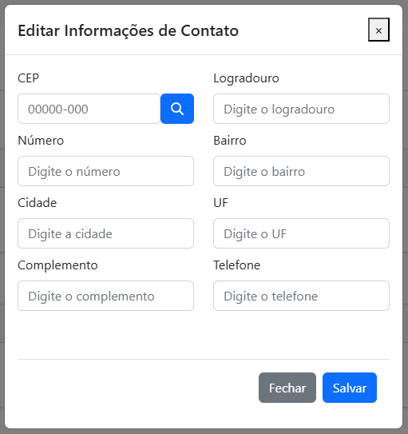

#### Categorias

##### Gerenciamento de categorias

- Lista de categorias cadastradas

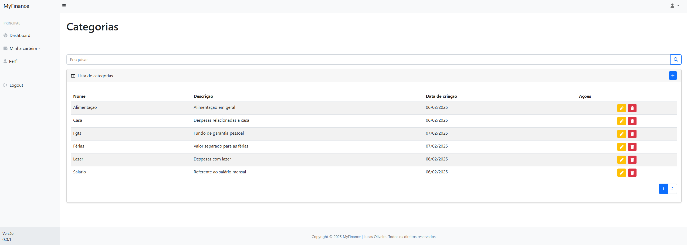

- Adicionar categoria

- Editar categoria

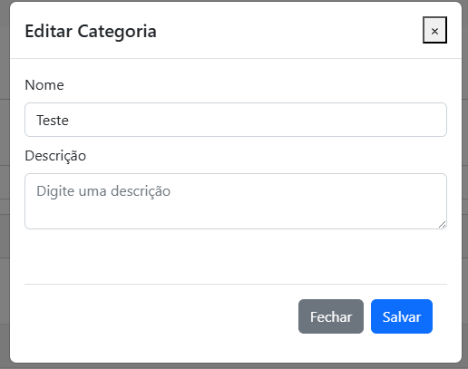

- Excluir categoria

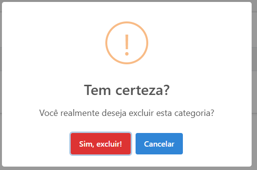

#### Despesas

##### Gerenciamento de despesas

- Lista de despesas cadastradas

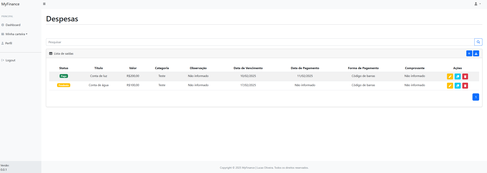

- Adicionar despesas

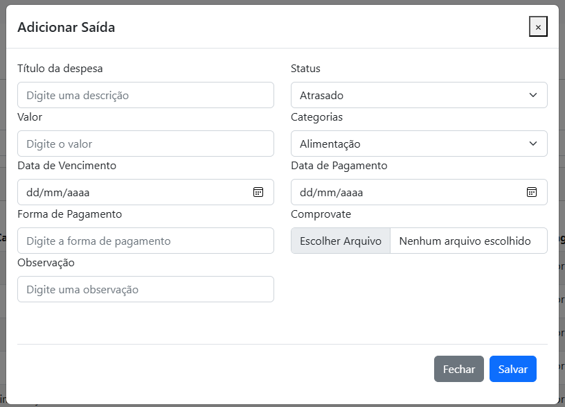

- Editar despesas

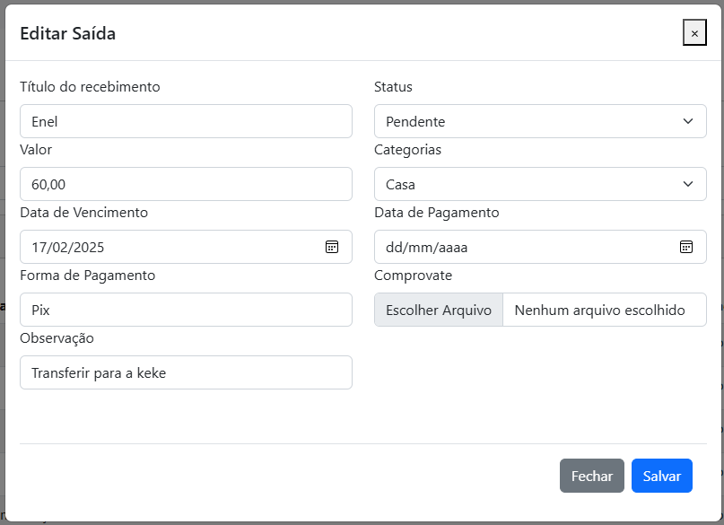

- Excluir despesas

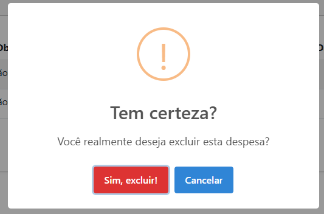

#### Receitas

##### Gerenciamento de receitas

- Lista de receita cadastradas

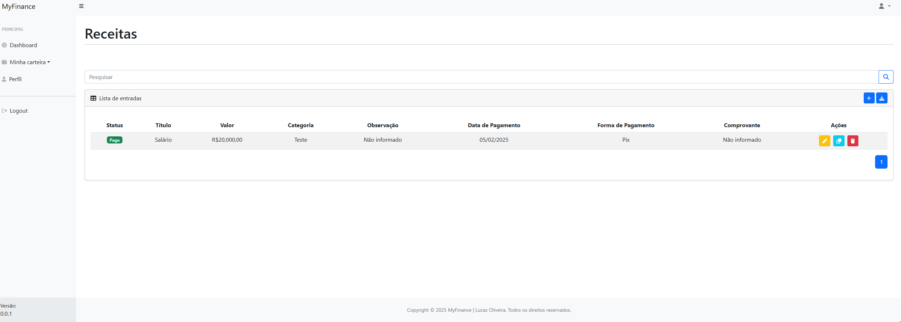

- Adicionar receita

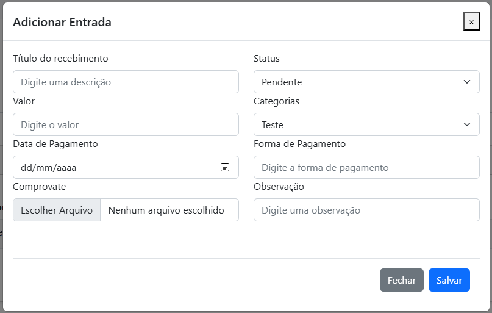

- Editar receita

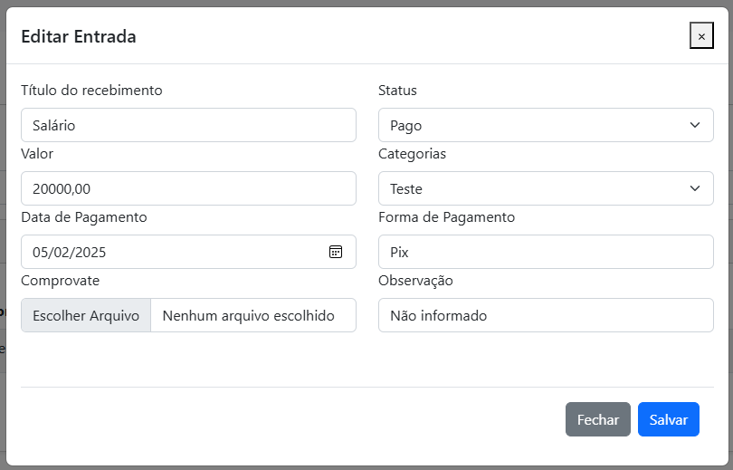

- Excluir receita

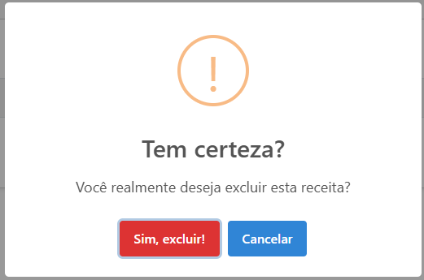

#### Investimentos

##### Gerenciamento de investimentos

- Lista de investimentos cadastradas

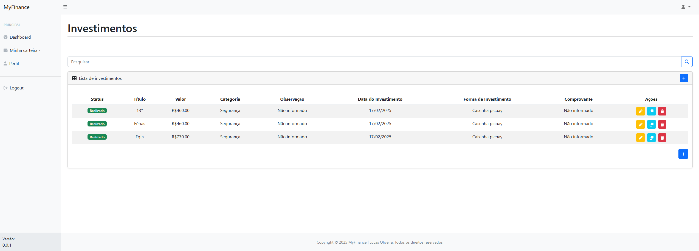

- Adicionar investimentos

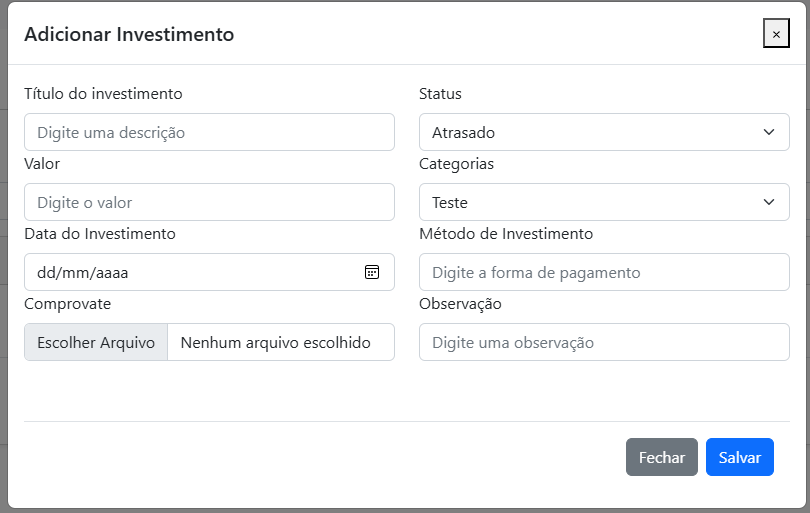

- Editar investimentos

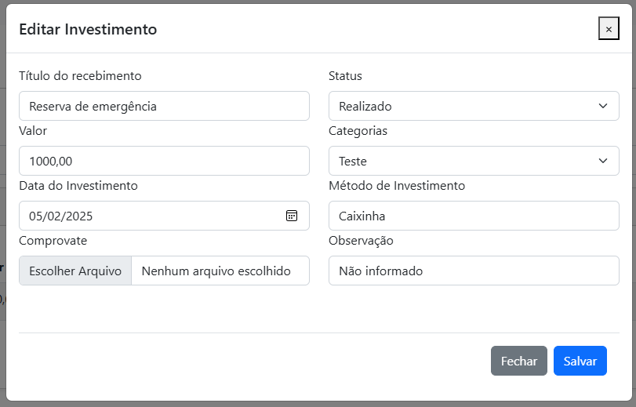

- Excluir investimentos

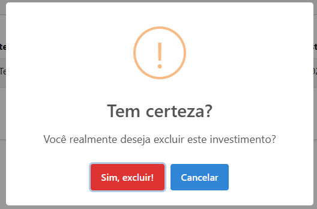

#### Relatórios

##### Download excel

- Exportar Despesa

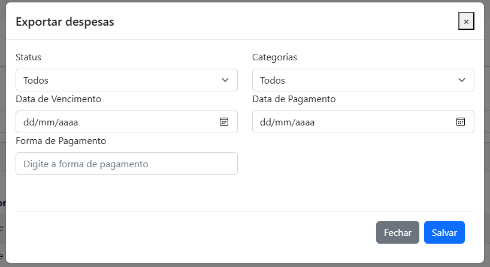

- Exportar Receita

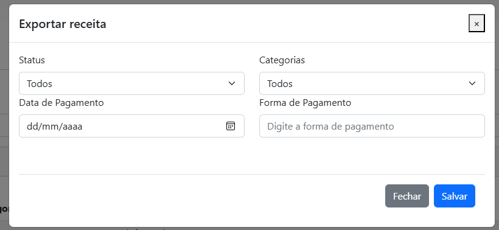

- Exportar investimentos

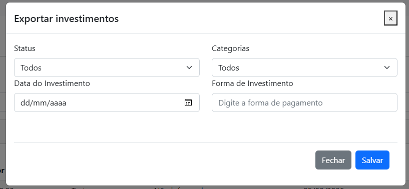

