# MyFinance.

Nesse repositório contém um projeto fullstack realizado o front-end com Html, Css, BootStrap 4, JavaScript e o back-end com Python e o framework Django.

O projeto consiste em um sistema para controle financeiro pessoal, é possível acompanhar toda a sua vida financeira em um só lugar, o sistema permite gerenciar despesas, receitas e investimentos. Também contém funcionalidades de relatório, como por exemplo, baixar uma planilha em excel com os dados das despesas, receitas e investimentos de acordo com os filtros escolhidos pelo usuário.

<br>

<h2>Pré-requisitos</h2>

- [Docker](https://www.docker.com/) 

<br>

<h2>Clone</h2>

```bash
git clone https://github.com/lucas-ioliveira/my-finance.git
```

<br>

<h2 id="started">🚀 Primeiros passos</h2>

<p>Basta entrar no diretório do projeto e no terminal rodar o comando:</p> 


```bash
docker compose -f docker-compose.yml up -d --build
```

<p>Isso fará com que todas as dependências sejam instaladas e um container docker seja executado.</p>

<br>

<p>Verifique se o container está em execução com o comando:</p>

```bash
docker ps -a
```

<br>

<h2 id="routes">📍Rotas</h2>

<p>As páginas são acessíveis somente com o usuário autenticado, obviamente, a home, login e cadastro são de livre acesso.</p>

**Home**

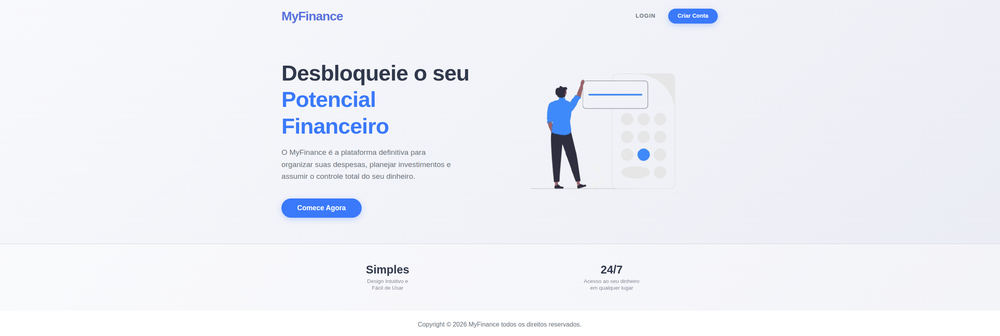

<br>

**Login**

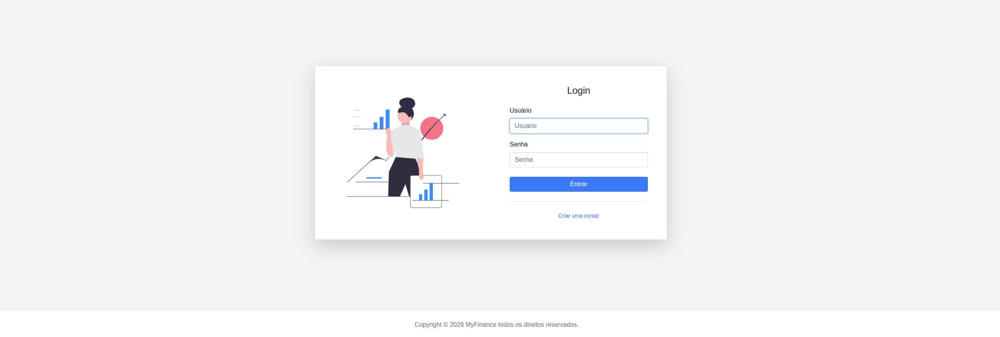

<br>

**Cadastre-se**

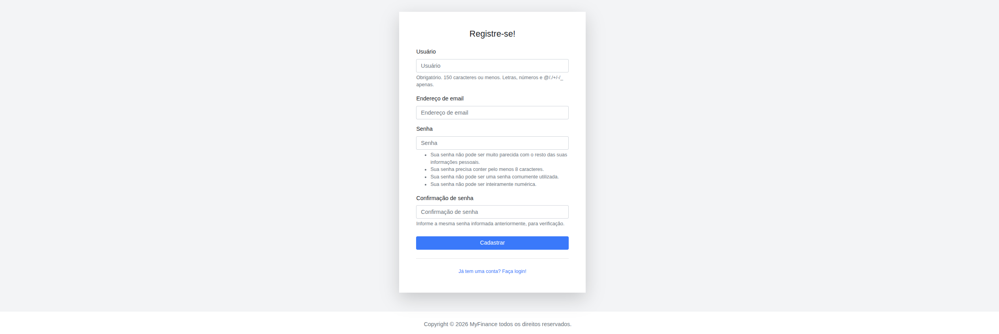

<br>

**Dashboard**

<p>Ao realizar o login, o usuário é direcionado para o seu dashboard</p>

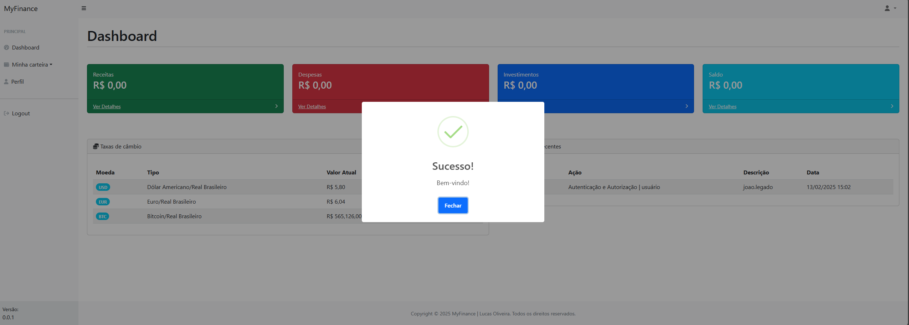

<br>

<p>Algumas informações relevantes são apresentadas, como o valor total de receitas, despesas, investimentos e o saldo (Equivalente a subtração das despesas e investimentos). Também conta com informações de câmbio, trazendo a cotação do dia das principais moedas e atividades recentes que são as ações do usuário no sistema.</p>

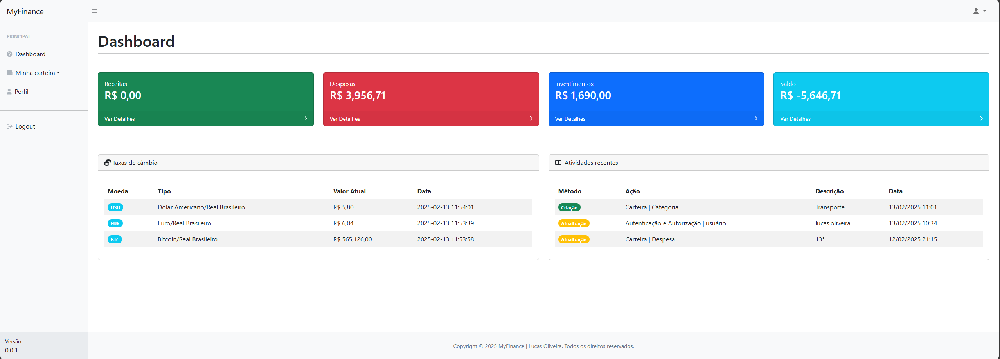

<br>

<p>No dashboard também conta com um filtro de períodos onde o usuário pode filtrar as datas que deseja e os cards com os valores serão atualizados de acordo com o filtro.</p>

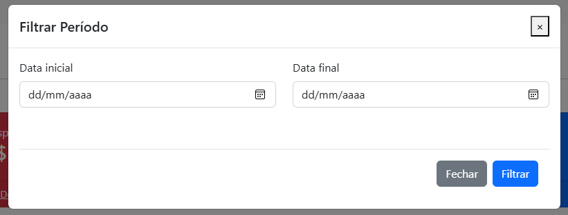

<br>

**Perfil**

<p>Visualização geral do perfil</p>

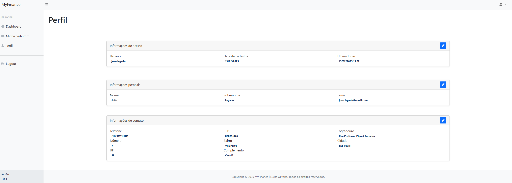

<br>

<p>Alterar senha</p>

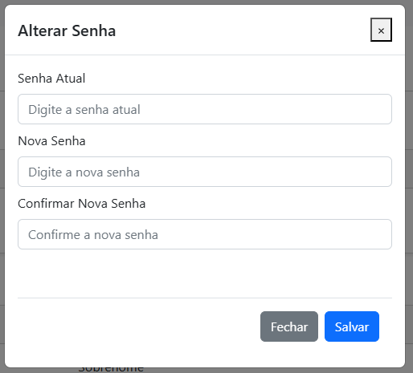

<br>

<p>Alterar informações pessoais</p>

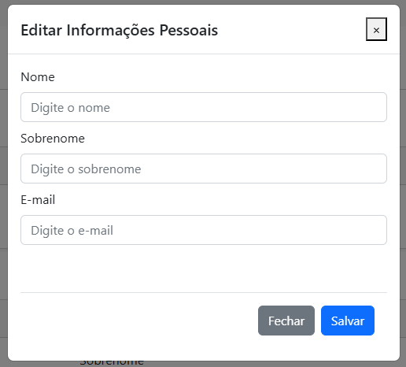

<br>

<p>Alterar endereço</p>
<p>Obs: Ao alterar o endereço, basta digitar somente o cep que os demais campos serão preenchidos automáticamente.</p>

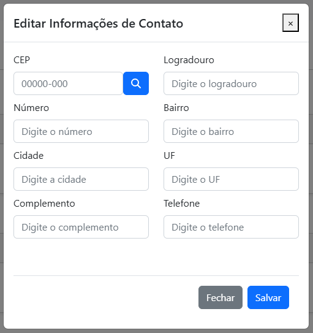

<br>

**Categorias**

<p>Lista de categorias cadastradas</p>

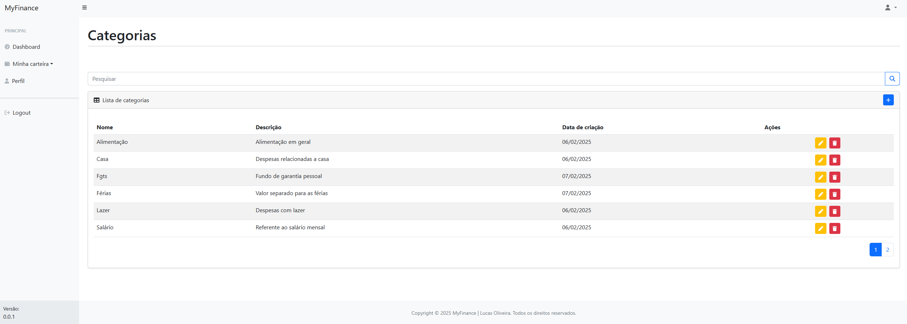

<br>

<p>Adicionar categoria</p>


<br>

<p>Editar categoria</p>

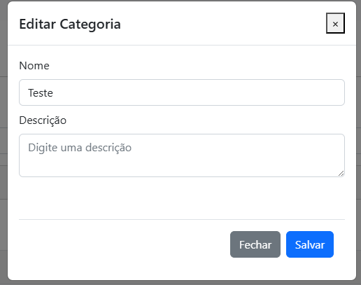

<br>

<p>Excluir categoria</p>

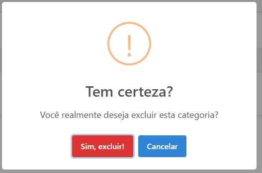

<br>

**Despesas**


<p>Lista de despesas cadastradas</p>

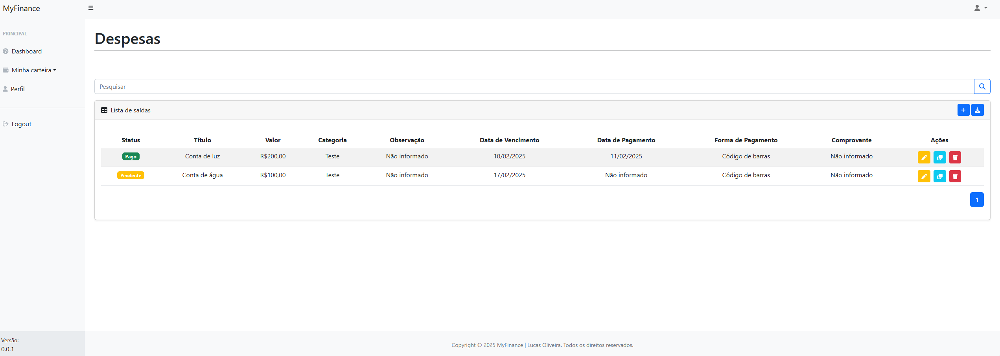

<br>

<p>Adicionar despesas</p>

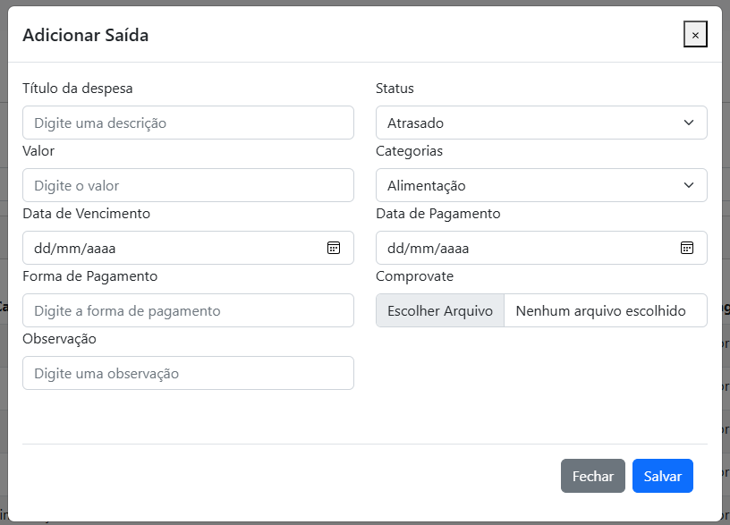

<br>

<p>Editar despesas</p>

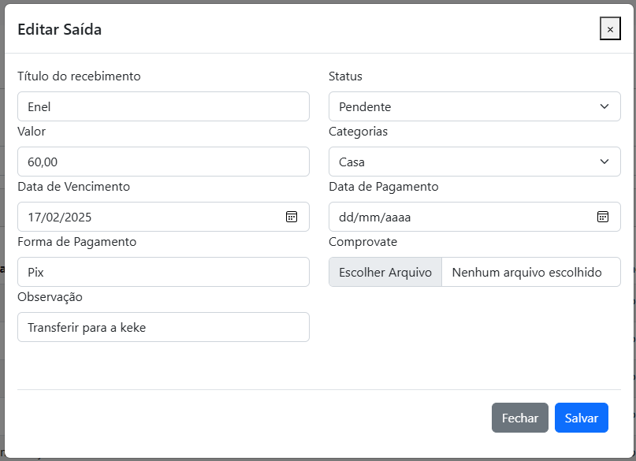

<br>

<p>Excluir despesas</p>

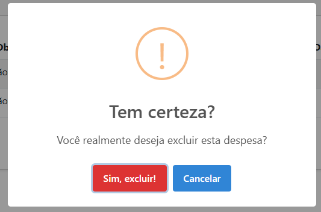

<br>

**Receitas**

<p>Lista de receita cadastradas</p>

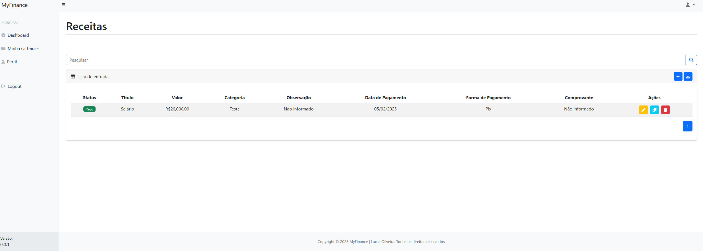

<br>

<p>Adicionar receita</p>

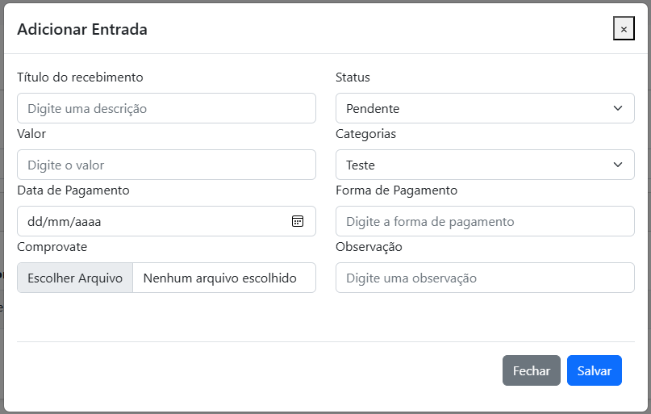

<br>

<p>Editar receita</p>

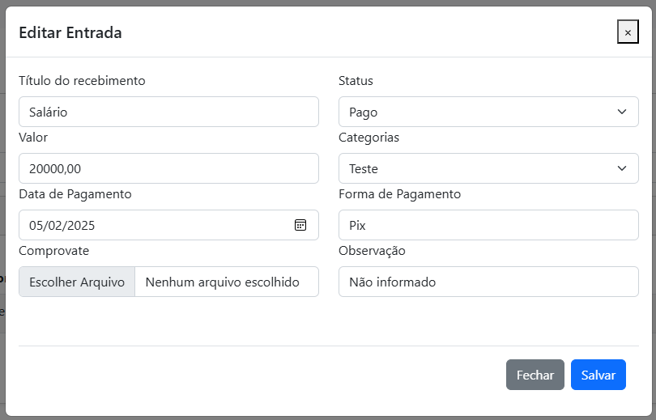

<br>

<p>Excluir receita</p>

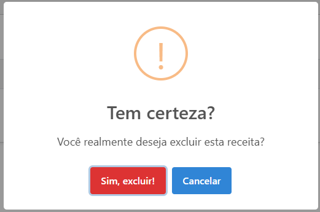

<br>

**Investimentos**

<p>Lista de investimentos cadastradas</p>

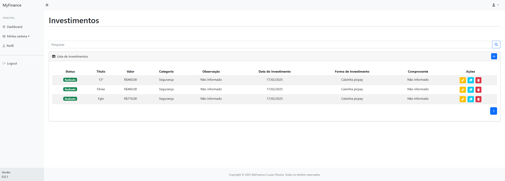

<br>

<p>Adicionar investimentos</p>

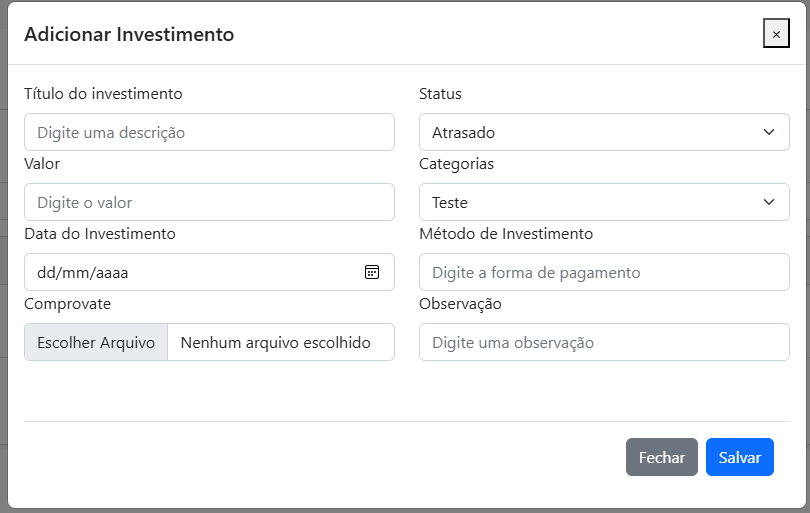

<br>

<p>Editar investimentos</p>

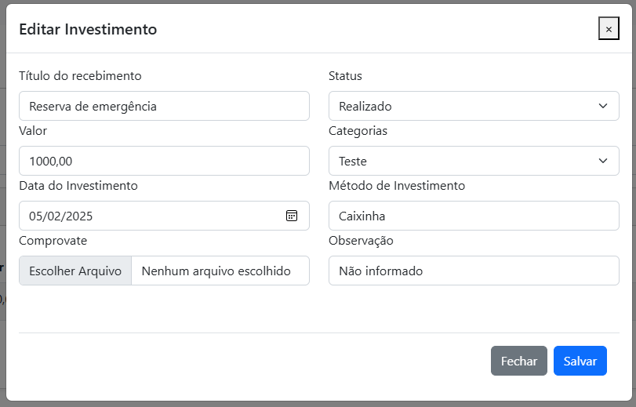

<br>

<p>Excluir investimentos</p>

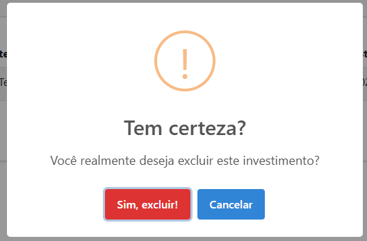

<br>

**Relatórios**

##### Download para excel

<p>Exportar Despesa</p>

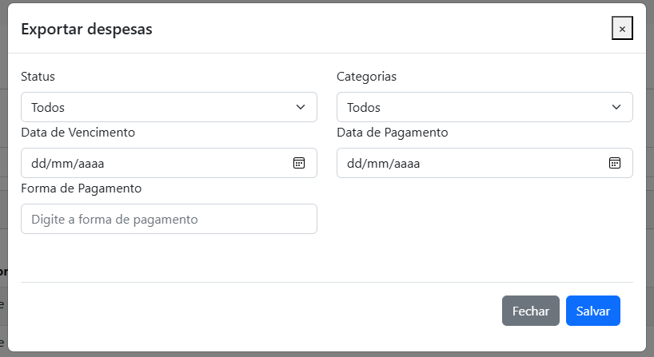

<br>

<p>Exportar Receita</p>

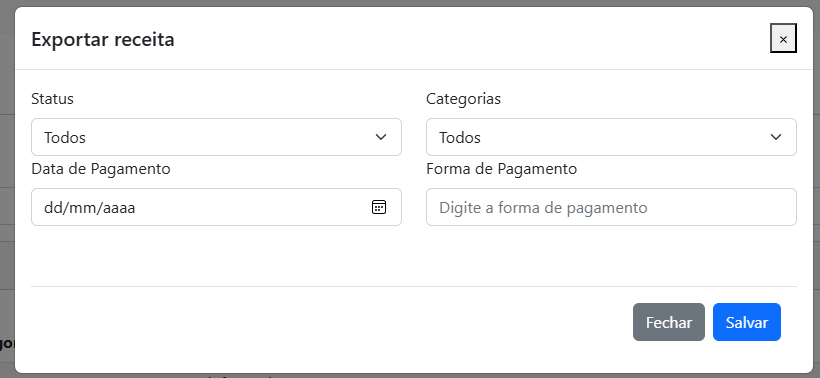

<br>

<p>Exportar investimentos</p>

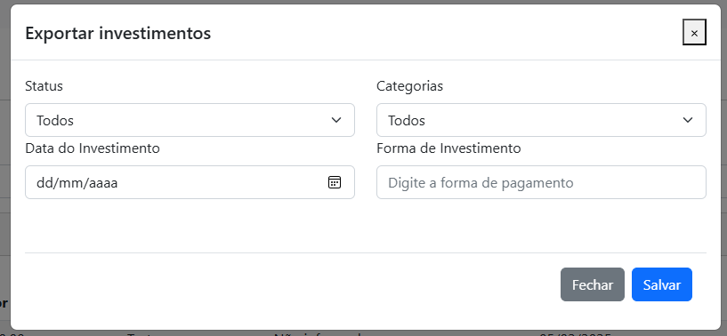

<br>

**Modelagem e arquitetura**

<p>Modelagem do banco de dados</p>

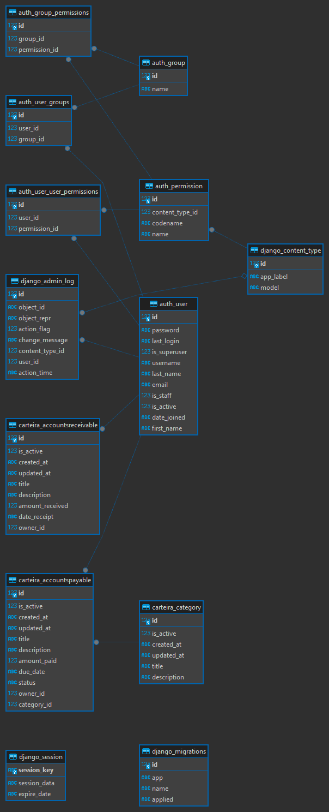

<br>

<p>schema</p>

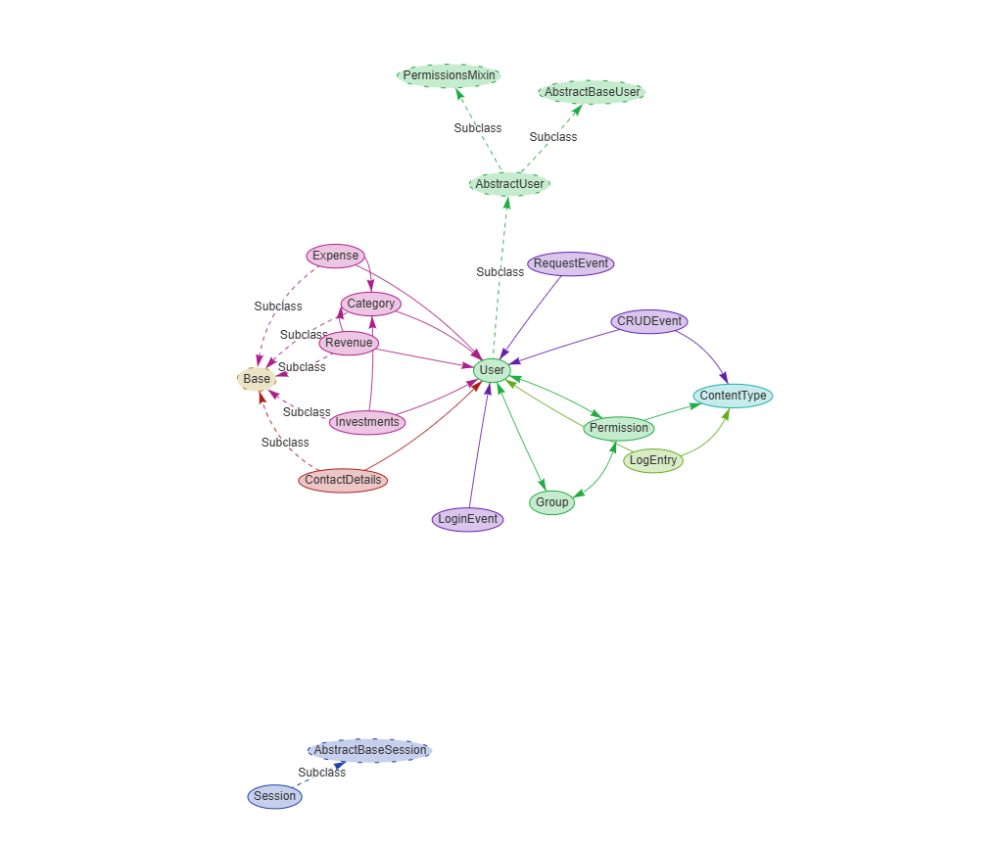


